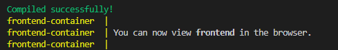

# Full Stack Application 🚀

Este é um projeto Full Stack de CRUD usando **Java Spring Boot** no backend, **React** no frontend, e **PostgreSQL** como banco de dados. O sistema permite o gerenciamento de usuários.

---

## Tecnologias Utilizadas

<p align="center">
  
  
  
  
  
  
</p>

---

## 🛠️ Como Executar o Projeto

### - Acessando a Aplicação na Nuvem (hospedagem gratuita, caso não esteja disponível, realizar passos a partir do docker-compose)

- **Front-end**: [https://front-end-app-ddef.onrender.com](https://front-end-app-ddef.onrender.com)
- **Swagger da API (Backend)**: [https://spring-app-tmdu.onrender.com/swagger-ui/index.html#/](https://spring-app-tmdu.onrender.com/swagger-ui/index.html#/)


### - Com Docker Compose (Recomendado)
1. Certifique-se de ter o **Docker** e o **Docker Compose** instalados em seu computador.
   - Verifique com os comandos:
     ```bash
     docker --version
     docker-compose --version
     ```

2. Clone este repositório:
   ```bash
   git clone https://github.com/anthonyMeds/full-stack-app-react-spring.git

3. Navegue até o projeto:
    ```bash
    cd full-stack-app-react-spring

4. - Subir a aplicação por meio do arquivo start:
    ```bash
    #No linux executar 
    start.sh
    #No windows executar 
    start.bat

5. - Ou Subir a aplicação diretamente com o docker-compose (Desconsiderar  o passo abaixo caso tenha executado o arquivo start) :
    ```bash
    docker-compose up --build

#### Aguarde a configuração do container (a primeira inicialização pode demorar)
- Cheque no doker desktop se os containers foram inicializado
    

- Ou verifique via terminal 



6. Acessar a aplicação:
    ```bash
    Acesse o Frontend: Abra o navegador e vá para http://localhost:3000
    Acesse o Backend: O backend estará disponível em http://localhost:8080


### Apis disponíveis: 

A seguir, estão as APIs expostas pelo backend (Spring Boot) para a manipulação de usuários:

- POST /pessoa: Cadastra um novo usuário.
- PUT /pessoa/{id}: Atualiza um usuário existente pelo ID.
- GET /pessoa: Retorna todos os usuários cadastrados.
- GET /pessoa/{id}: Retorna os detalhes de um usuário específico pelo ID.
- DELETE /pessoa/{id}: Deleta um usuário pelo ID.
   

